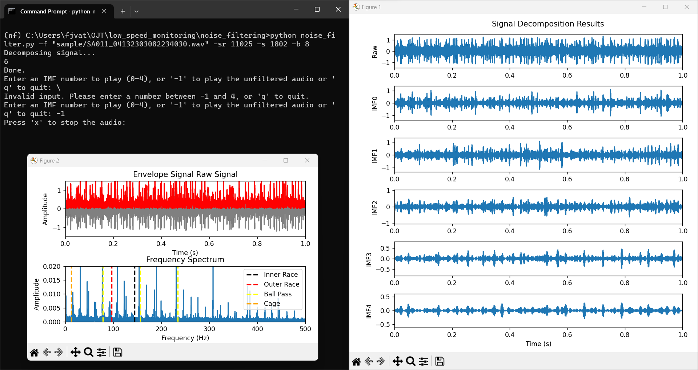

# Denoising-LSMNT

## Installation
`pip install -r requirements.txt`

## Sample Usage

```bash
$ python noise_filter.py -f "sample/SA011_04132303082234030.wav" -sr 11025 -s 1802 -b 8
Decomposing signal...
```

## Parameters
```bash
parser.add_argument('-f', '--wav_file', dest='wav_file', type=str, required=True, help='WAV Filepath')
parser.add_argument('-sr', '--sample_rate', dest='sr', type=int, default=11025, help='Sample Rate')
parser.add_argument('-s', '--speed', dest='speed', type=int, default=None, help='Bearing speed in RPM')
parser.add_argument('-b', '--balls', dest='balls', type=int, default=None, help='Bearing # of balls')
```

## Sample Output


